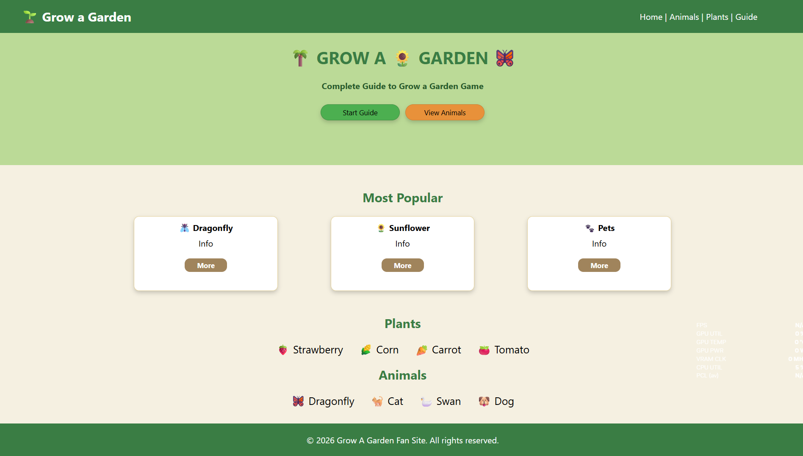

# Grow a Garden Website

A simple and colorful Grow a Garden fan website built with HTML and CSS.


## preview




## Live Demo

[View Website](https://sadradev89.github.io/grow-a-garden-website-html-css/)


## Features

* Grow a Garden themed design
* Animals section
* Plants section
* Popular items section
* Navigation menu
* Custom buttons
* Clean and simple layout
* Green-themed design

## Built With

* HTML5
* CSS3

## Project Structure

```text
grow-a-garden-website-html-css/
│
├── index.html
├── css/
│   └── style.css
└── assets/
```

## Purpose

This project was created as a practice project while learning HTML and CSS.

It helped me practice:

* HTML page structure
* CSS styling
* Flexbox
* Positioning
* Buttons
* Navigation
* Cards
* Colors and spacing

## Disclaimer

This is an unofficial fan-made project and is not affiliated with or endorsed by the creators of Grow a Garden or Roblox.

## Author

Created by SadraDev89

If you like the project, consider giving it a star.
